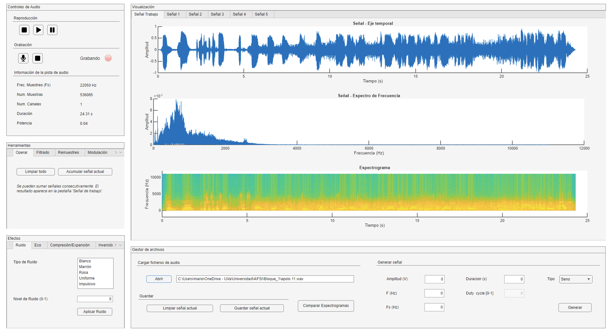
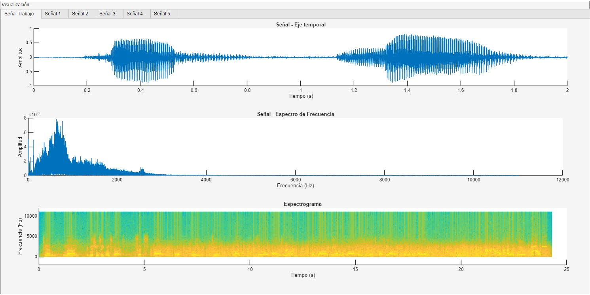
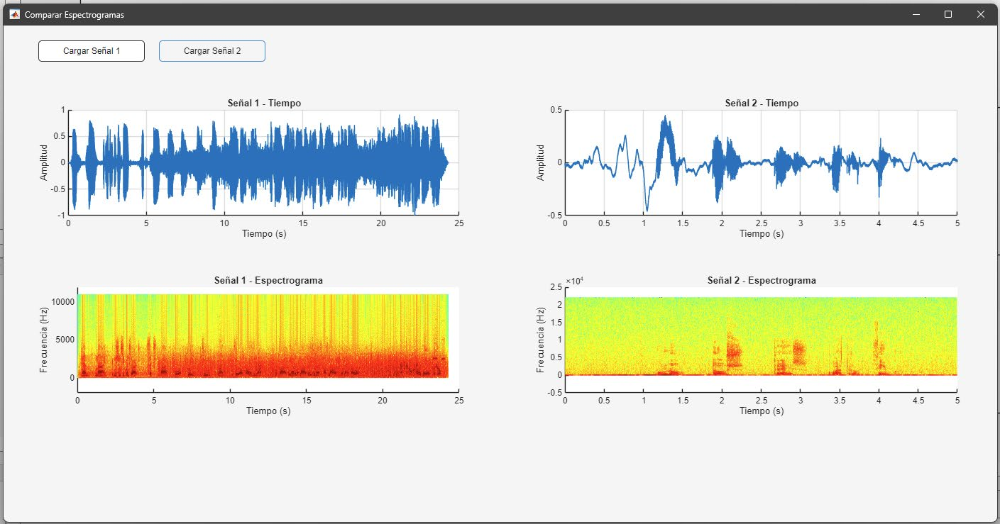

<div align="center">

# 🎵 Audio Signal Analysis & Processing Suite

**A complete desktop application for recording, visualizing, processing and analyzing audio signals built from scratch in MATLAB App Designer.**

[](https://www.mathworks.com/products/matlab.html)
[](https://www.mathworks.com/products/signal.html)
[](https://www.mathworks.com/products/audio.html)
[](https://huggingface.co/openai/whisper-large-v3-turbo)



</div>

---

## Overview

This project is a feature-rich **Graphical User Interface (GUI)** for digital audio processing. It brings together everything you would expect from an audio workbench — loading and recording sound, plotting it in the time and frequency domains, applying filters and effects, modulating and quantizing signals, and even **transcribing speech to text with AI** — all inside a single, clean, easy-to-use desktop app.

The interface is organized into **four clearly separated areas** so that every tool is one click away:

| Panel | What it does |
|-------|--------------|
| 🎙️ **Audio Controls** | Playback (play / pause / stop), microphone recording, and live signal info |
| 📊 **Visualization** | Time waveform, frequency spectrum and spectrogram — up to **6 signals** in parallel tabs |
| 🛠️ **Tools** | Arithmetic, filtering, resampling, modulation, quantization, reconstruction |
| 🎚️ **Effects** | Noise, echo, reversal, reverb/Haas/masking, time-stretch, AI transcription |

Every visualization tab is fully **independent**: you can load, process and even play several audio tracks at the same time, each with its own player and processing chain.

---

## ✨ Key Features

### 📁 Signal & File Management
- **Open / save** `.wav` audio files through a native file browser.
- **Signal generator** — synthesize periodic waveforms with full control over amplitude, frequency, sample rate, duration, duty cycle and number of periods:
  `sine` · `cosine` · `square` · `rectangular` · `triangular` · `sawtooth` · `chirp`
- **Up to 6 signals at once** — a *Work Signal* tab plus *Signal 1–5*, each with its own state.
- One-click clearing of the current signal.

### 📈 Visualization (three synchronized views per tab)
- **Time domain** — auto-scaled waveform with zoom / pan, stereo-aware (one trace per channel).
- **Frequency domain** — single-sided **FFT** magnitude spectrum.
- **Spectrogram** — time–frequency energy map for spotting noise, tonal shifts and acoustic patterns.
- A **live playback cursor** sweeps across the waveform as the audio plays.

<div align="center">

</div>

### ▶️ Playback & Recording
- Independent audio player per tab — **play several tracks simultaneously**.
- **Microphone recording** with a live waveform and a recording indicator light.
- Real-time **signal info panel**: sample rate, number of samples, channels, duration and power.

### 🛠️ Analysis & Processing Tools
| Tool | Highlights |
|------|-----------|
| **Arithmetic** | Add / accumulate up to 5 signals into the work tab |
| **Digital filtering** | Low-pass, high-pass, band-pass and band-stop **Butterworth** filters, applied with **zero-phase `filtfilt`** and configurable order & cutoffs |
| **Resampling** | Convert to a target sample rate, or set custom **interpolation / decimation** factors (with anti-aliasing) |
| **Modulation / Demodulation** | **AM, FM, PM, ASK, FSK** — demodulation via the Hilbert transform |
| **Quantization** | N-bit quantization (0–16 bits) to visualize quantization noise & distortion |
| **Reconstruction filters** | **Sample & Hold** and **linear interpolation** to rebuild a continuous signal |

### 🎚️ Effects & Psychoacoustics
- **Noise generators**: white, brown, pink, uniform and impulsive noise.
- **Echo** with adjustable delay, intensity and optional cascaded repetitions.
- **Time reversal** — play any signal backwards (great for exploring sonic palindromes).
- **Sound effects**: reverb (exponential-decay convolution), **Haas effect** (stereo widening) and **frequency masking**.
- **Time-scale compression / expansion** — speed a recording up or slow it down.
- 🤖 **AI speech-to-text** — transcribe spoken audio using OpenAI's **Whisper large-v3-turbo** via the Hugging Face Inference API.

### 🔬 Spectrogram Comparison
A dedicated window loads **two signals side by side** and plots their waveforms and spectrograms together — ideal for comparing originals against processed versions or hunting for acoustic patterns.

<div align="center">

</div>

---

## 🧠 How It Works

The application is a single **MATLAB App Designer** project (`P1.mlapp`) backed by a clean, modular architecture:

- **Per-tab state via accessor methods** — instead of duplicating logic, each of the six tabs stores its own audio data, sample rate and player, accessed through `get`/`set` helpers (`getAudioData` / `setAudioData`, `getFs` / `setFs`, `getPlayer` / `setPlayer`, …) that switch on a `tabIndex`. This keeps the six parallel signals fully isolated.
- **`updateTab()`** detects the active tab and refreshes the info panel and player accordingly.
- **`updatePlot()`** redraws the three axes (time, FFT, spectrogram), converting multichannel audio to mono when needed.
- **`updateCursor()`** animates the playback position in real time from `player.CurrentSample / Fs`.
- **Robust error handling** — `try/catch` blocks plus `uialert` / `errordlg` dialogs give the user immediate, friendly feedback instead of silent failures.

Under the hood it leans on MATLAB's DSP stack: `fft`, `butter`, `filtfilt`, `resample`, `upsample`/`downsample`, `spectrogram`, `hilbert`, `conv`, `interp1`, `pinknoise` and `audioplayer`/`audiorecorder`.

---

## 🧰 Tech Stack

- **MATLAB R2024b**
- **App Building Toolbox** — GUI design (App Designer)
- **Signal Processing Toolbox** — filtering, resampling, spectral analysis
- **Audio Toolbox** — advanced audio I/O and processing
- **Hugging Face Inference API** — cloud AI transcription (OpenAI Whisper)

---

## 🚀 Getting Started

### Requirements
- MATLAB **R2024b** (or newer) with the **App Building**, **Signal Processing** and **Audio** toolboxes installed.
- *(Optional)* A Hugging Face API token to enable the AI speech-to-text feature.

### Run it
1. Clone or download this repository.
2. Open MATLAB and navigate to the **`Bloque_1/`** folder.
3. Add the folder to the MATLAB path.
4. Open and run **`P1.mlapp`** (double-click it or type `P1` in the Command Window).

That's it — the interface launches and you can immediately load a `.wav`, generate a tone, or record from your microphone.

> **Note:** to use the AI transcription tool you must supply your own Hugging Face API token in the app's authentication field.

---

## 📂 Repository Structure

```
.
├── Bloque_1/                 # 🎵 Audio analysis & processing suite (this project)
│   ├── P1.mlapp              #    Main MATLAB App Designer application
│   ├── Audios/               #    Sample audio files for testing
│   ├── Imgs/                 #    UI icons (play, pause, mic, save, …)
│   ├── Recursos/             #    Reference material & example interfaces
│   └── Memorias/             #    Project reports (functionality & programming)
└── docs/images/              # Screenshots used in this README
```

---

## 🗺️ Possible Improvements

- Machine-learning features such as sound-event detection and music-genre classification.
- More psychoacoustic effects and processing tools.
- Performance tuning for very large signals to keep the UI responsive.
